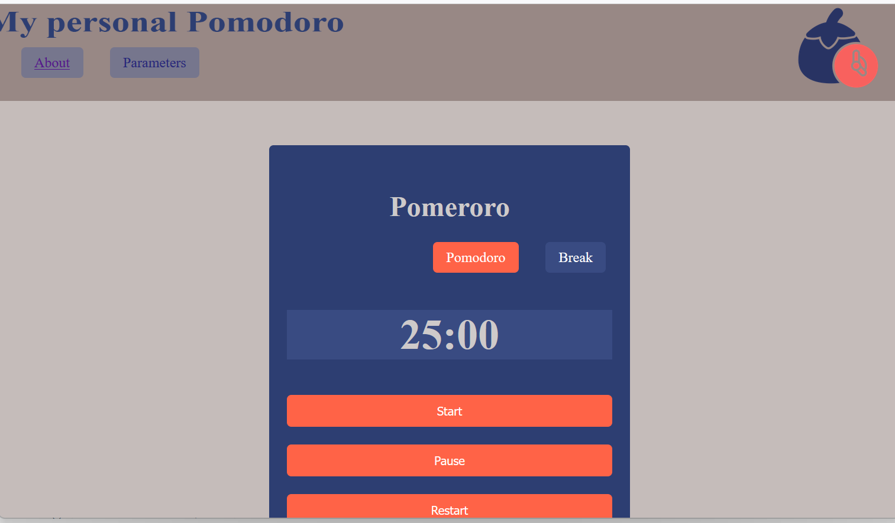

# Pomodoro Web App

## Goal : 
This project was developed to practice **JavaScript**, **HTML**, and **CSS** skills.  
It is a remake of the classic **Pomodoro application** but a personnal code.

##  Features : 
- A countdown timer for **work** and **break** sessions (default: 25 min work, 5 min break).  
- A **Parameters** panel to change the duration of each session.  
- Ability to add **background music** during the work session.

⚠️ Note: You must provide a **direct MP3 link** (YouTube/Spotify links won’t work).  
Here is a test track you can use:  
[SoundHelix Test Track](https://www.soundhelix.com/examples/mp3/SoundHelix-Song-1.mp3)
Or download to your local repository of the projects mp3 that you want to use

## Technologies : 
- **HTML**  
- **CSS**  
- **JavaScript**

## Usage : 
- Clone or download this repository.  
- Open the project in a code editor (developed on **Windows** with **Visual Studio Code**).  
- Run it with a local server (e.g., VSCode’s **Live Server** extension).

##  Desktop / PWA Version : 
This project also includes a `manifest.json` and a `service-worker.js` to test installing the app as a **Progressive Web App (PWA)**.  
It will not work directly from `file://`. You need to serve it over **http:// or https://** (e.g., GitHub Pages).

## Feedback : 
Thanks for your feedback and suggestions!
 

You can find a similar topic in roadmap for more help in creating your own pomodoro timer : https://roadmap.sh/projects/pomodoro-timer
**Author**: Rd.mera  
*Personal Project*
